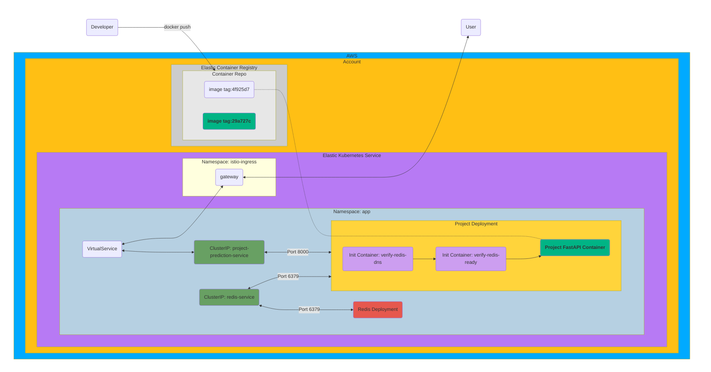

# Machine Learning Model Deployment

End-to-end deployment of a sentiment-analysis NLP model as a production-grade prediction API on AWS, with caching, autoscaling, load testing, and observability.

<!-- markdownlint-disable MD028 -->

<p align="center">
    <!--Hugging Face-->
        
    <!--PLUS SIGN-->
        
    <!--FASTAPI-->
        
    <!--PLUS SIGN-->
        
    <!--REDIS LOGO-->
        
    <!--PLUS SIGN-->
        
    <!--KUBERNETES-->
        
    <!--PLUS SIGN-->
        
    <!--AWS-->
        
    <!--PLUS SIGN-->
        
    <!--k6-->
        
    <!--PLUS SIGN-->
        
    <!--GRAFANA-->
        
</p>

## Overview

This project packages a fine-tuned [DistilBERT](https://arxiv.org/abs/1910.01108) sentiment-classification model and serves it as a horizontally-scalable prediction API on AWS EKS. The system is designed to handle bursty traffic with low latency by combining a Redis cache, Kubernetes horizontal pod autoscaling, and an Istio-based ingress.

**Highlights**

- FastAPI service exposing typed prediction endpoints validated with Pydantic
- DistilBERT model (~300 MB) baked into the Docker image for fast cold starts
- Redis caching layer keyed per request to absorb repeated traffic
- Kubernetes deployment with init containers, health probes, and HPA
- Istio VirtualService for path-based routing
- Load tested with `k6`; metrics observed via Grafana

## Architecture



## Tech Stack

| Layer | Tooling |
|---|---|
| Model | DistilBERT (fine-tuned on SST-2), HuggingFace Transformers |
| API | FastAPI, Pydantic |
| Caching | Redis |
| Packaging | Poetry, Docker |
| Orchestration | Kubernetes (EKS), Kustomize, Istio |
| Cloud | AWS (ECR, EKS) |
| Load Testing | k6 |
| Observability | Grafana |

## API

**Request**

```json
{
  "text": ["example 1", "example 2"]
}
```

**Response**

```json
{
  "predictions": [
    [
      { "label": "POSITIVE", "score": 0.7127904295921326 },
      { "label": "NEGATIVE", "score": 0.2872096002101898 }
    ],
    [
      { "label": "POSITIVE", "score": 0.7186233401298523 },
      { "label": "NEGATIVE", "score": 0.2813767194747925 }
    ]
  ]
}
```

## Project Layout

```
.
├── .k8s/             # Kustomize base + overlays for Kubernetes deployment
├── mlapi/            # FastAPI application
│   ├── src/          # Application source
│   ├── tests/        # pytest suite
│   ├── trainer/      # Training reference scripts
│   ├── Dockerfile
│   └── pyproject.toml
└── load.js           # k6 load-test script
```

## Running Locally

```bash
cd mlapi
poetry install
poetry run uvicorn src.main:app --reload
```

Run the test suite:

```bash
poetry run pytest
```

## Building and Deploying

Build and push the image to ECR, then apply the Kustomize overlay:

```bash
docker build -t <ecr-repo>/project:<tag> mlapi/
docker push <ecr-repo>/project:<tag>
kubectl apply -k .k8s/overlays/<env>
```

The deployment includes:

- Init containers that verify Redis DNS and readiness before the API starts
- Liveness, readiness, and startup probes on `/project/health`
- A horizontal pod autoscaler tuned for burst traffic

## Load Testing

```bash
k6 run -e NAMESPACE=${NAMESPACE} \
  --summary-trend-stats "min,avg,med,max,p(90),p(95),p(99),p(99.99)" \
  load.js
```

## Performance Targets

Under sustained load with a warm cache, the deployed service achieves:

- ~10 requests/second sustained throughput on the predict endpoint
- p(99) latency under 2 seconds at 10 virtual users
- 95%+ cache hit rate via the Redis caching layer

## Design Notes

- **Model baked into the image.** The model is copied in at build time rather than pulled from HuggingFace at startup, keeping cold-start time low during scale-out events. In production, mounting from shared storage (EFS/S3) would be the next step.
- **Resource tuning.** Pod requests and limits are calibrated for the ~300 MB model footprint to balance scheduling headroom against memory pressure.
- **Path-based routing.** A single Istio VirtualService routes traffic to the prediction service by URL prefix, allowing additional services to be added without ingress changes.

## License

[MIT](LICENSE)
